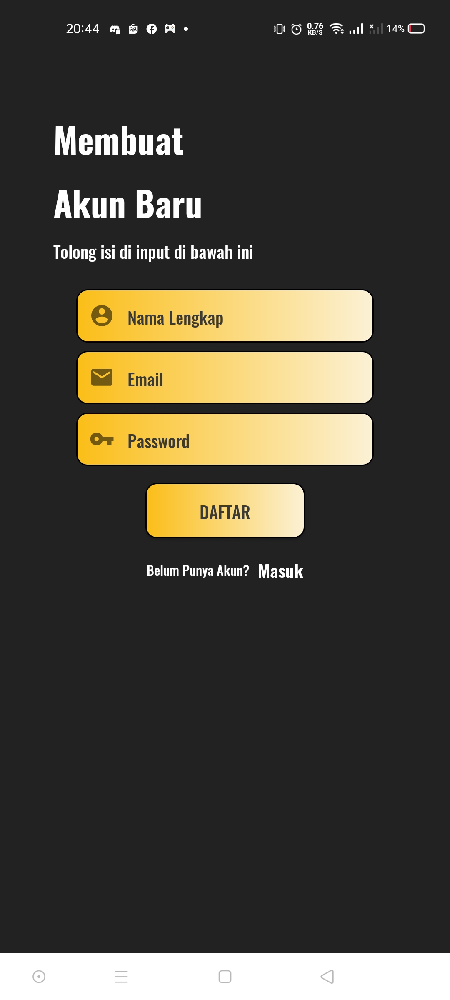
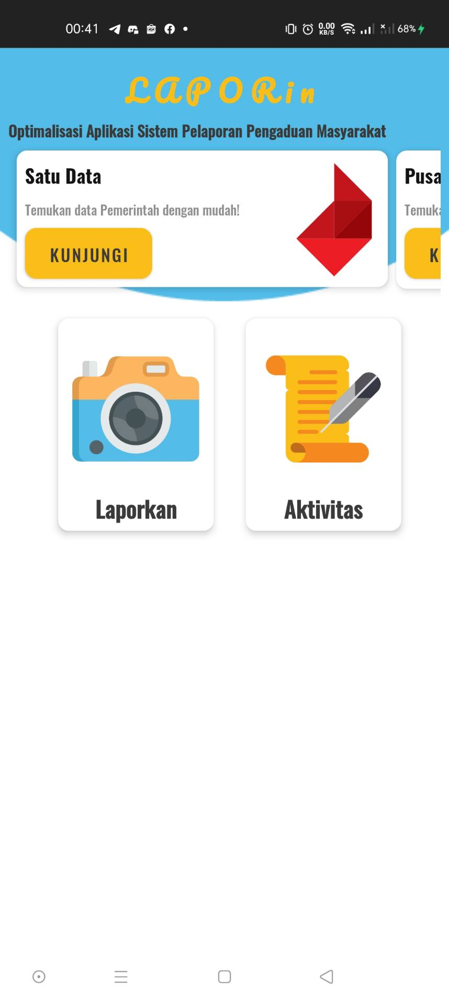
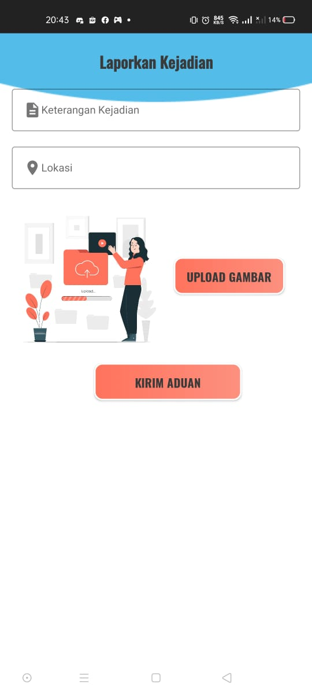
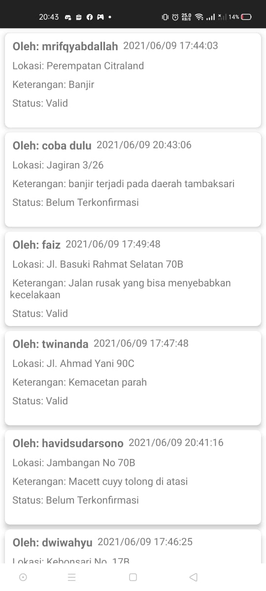

LaporIn - B21-CAP0347 (Android)
=

Project Team Member
-
- Muhammad Rima Mustaghfirin Bil Ashar - A2962667
- Dwi Wahyu Effendi - A2962674
- Muhammad Rifqy Abdallah - C3122780
- Twinanda Hawary Nurfaizi - C3122788
- Faiz Khansa Adrika - M0080838
- Havid Sudarsono - M0080843

Capstone Project Introduction
-
- There are many applications developed by the government with public complaint reporting as one of its features (or maybe the only feature). Some of these applications are Jakarta Smart City, Jalan Cantik, and SIKOJA. In these applications, the public can make complaints, reporting things such as damaged roads, damaged bridges, trees covering the highway, and many other cases concerning public facilities’ conditions.
To make a complaint report, the public (a user) is required to upload some photos of evidence, scene information, a short description of what happened; and then chooses the case of the report being made. After that, the report is simply sent to the system for then gets checked by related officers. This process might sound totally fine, but we find a problem there.
- The problem we found is that these applications act as “a place for collecting reports”, literally. What we mean by it is that the system has no filtering procedure for incoming reports. All the reports being made are received by the system and need to be validated by officers one by one, including fake reports and the invalids. A user can pretend to make a road damage report while the photos of evidence are totally unrelated to the case being reported, and this fake report will still get received by the system and not considered spam. The absence of a filtering procedure in these applications makes the work of officers become inefficient and more time-consuming. Therefore we propose an idea to implement Machine Learning in the public complaint reporting system.
- The first step that can be taken for that implementation is to make a filtering procedure for fake or invalid reports. This implementation will increase the efficiency of officers’ work, making them able to focus on handling only valid reports, therefore making the public services become more effective. There are many more possible steps that can be taken, but given the limited time we have, we will focus on this filtering procedure only.

Steps/Code Explanation
-

This application is able to identify reports in the form of images which will later be processed with machine learning models. And then it will enter the data into the database, which will store all the traffic problem information stored in it to be matched with the image of the report to be identified by machine learning. Currently, there are three categories of traffic problems :
- Traffic Jam,
- Flood,
- Road with Potholes.

And the app will tell us the report image is valid or not. If the report detected by the system is correct, then the report will be forwarded to all application users. But if the report is invalid, then the report will be included in the spam category, and not shown to general users.

The app works by fetching images from the user's gallery, and then uploading those images to a machine learning model applied to a Virtual Machine Instance with Cloud Computing, where the app retrieves the classification results.

Helper dependencies used in this app are:
- Glide: to display images,
- Picasso: to image loading and processing,
- Retrofit OkHttp3: framework for authenticating and interacting with APIs and sending network requests with OkHttp,
- Koin: for dependency injection,
- Firebase: 
  - Authentication: to authenticate users to our app
  - Firestore
  - Storage

There are two main modules in this android project: Application module and Core module. The app module will contain most of the UI processes and classes needed for the UI to work, while the Core will contain most of the background work.

In the app module, there are several UI layouts:
- dashboard
- history
- report
- sign in
- sign up
- splash screen
- report items

When the app is run, the SplashscreenActivity in the splashscreen pack will be started, its displaying a Logo with animation to greet the user. And then the application will go to the login page.

On the login page, SignInActivity will be presented for the application Login page containing the email and password. Users who still don't have an account, can register with SignUpActivity that has been connected to firestore authentication.

After successfully logging in to the application, the user will be directed to the DashboardActivity which contains:
- Cardview to display the timeline or the latest news
- RelativeLayout to go to ReportActivity page and report and HistoryActivity.

In Cardview above, if pressed it will be redirected to the internet webpage.

If we select Report Page, it will open ReportActivity which is used by users to write reports in the form of report descriptions, the scene, and evidence of the report in the form of photos to be processed into our Machine Learning and Cloud Computing.

Last, if we press the "Aktivitas" Activity on that DashboardActivity, all valid reports that have been submitted by various users resulting from Machine Learning and Cloud computing processing will appear on the HistoryActivity view.

