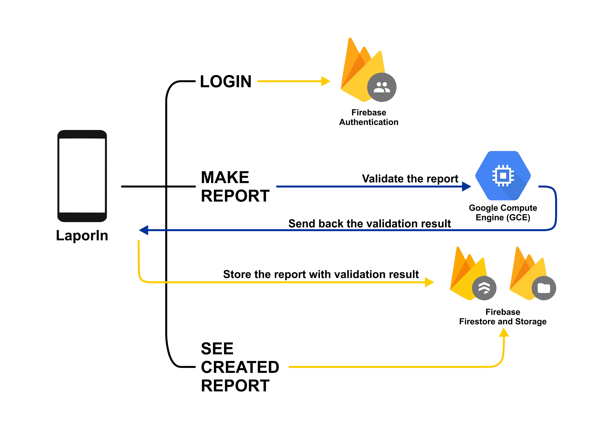

# About

This is the repository of team B21-CAP0467 for Bangkit 2021 Capstone Project. Each directory represents the work of each learning path.

We are building an android app that implements the optimization of public complaint reporting system. See our project plan's document [here](https://docs.google.com/document/d/1ERY-RYOeCeVoexsL9cSqmGrSyCTo2Ne10evF72l23Jk).  
_(Note: @bangkit.academy account is required)_

## App Architecture

The overall app architecture is shown in the image below

